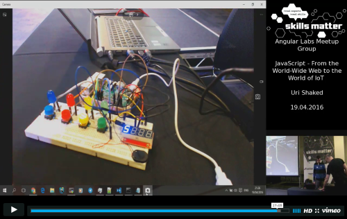

# Angular 2 IoT
> IoT support for Angular 2

# Building & Running the Blink example

The [Blink Example](https://github.com/urish/angular2-iot/blob/master/examples/blink.ts) will blink the built-in 
LED on an Adruino board that is connected to your PC. You will need to upload the 
[StandardFirmata firmware](https://github.com/firmata/arduino) to your Arduino board first. 

    git clone https://github.com/urish/angular2-iot
    cd angular2-iot
    npm install
    npm run example:build
    npm run example:run
    
Note: The example program will try to detect the serial port that the Arduino 
is connected to automatically. You can manually specify the port name by 
setting the `SERIAL_PORT` environment variable prior to running the example.

# Presentation (April 2016)

Check out [ng2-simon](https://github.com/urish/ng2-simon) for a complete example of using angular2-iot for powering a game
that can be run both inside the web browser and on real hardware.

# License

